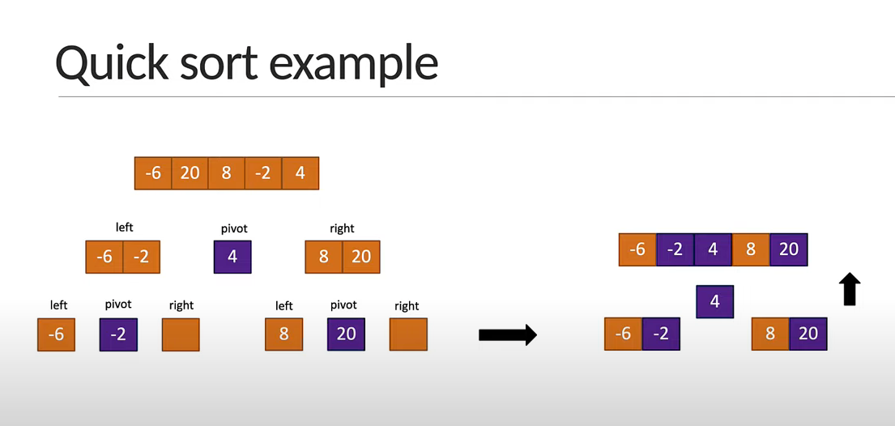
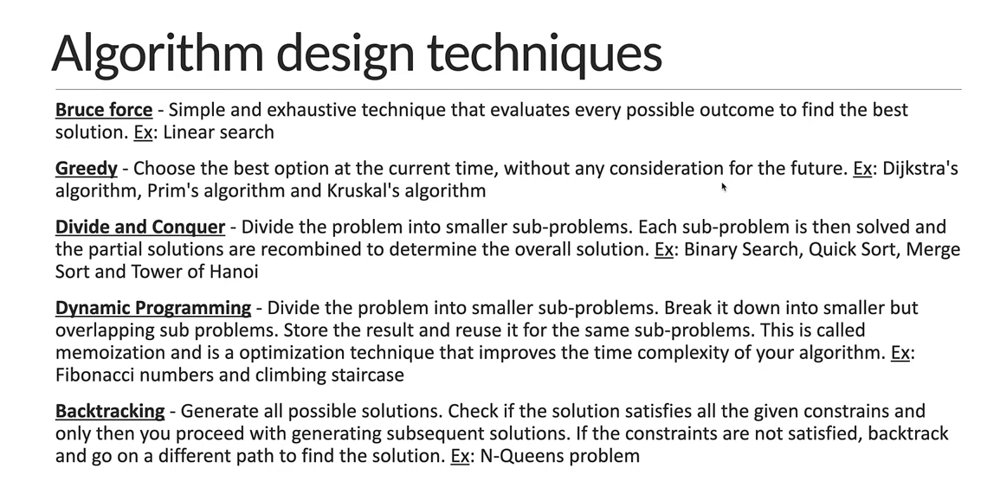

# Big- O Guide

### Calculation not dependent on input size - O(1)

| operation                 | Big-O    |
|---------------------------|----------|
| loop                      | O(n)     |
| nested loops              | O(n^2)   |
| input size reduced by 1/2 | O(log n) |

---
# Recursive - Time Complexity

# Quick Sort

# Algorithm Design Techniques
