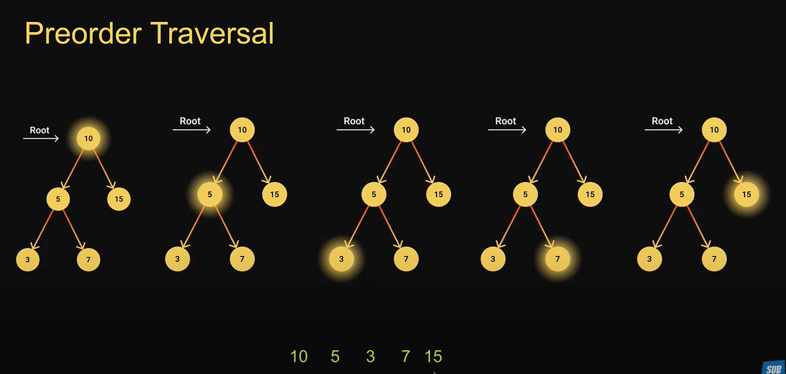
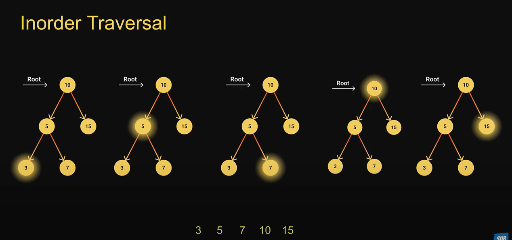
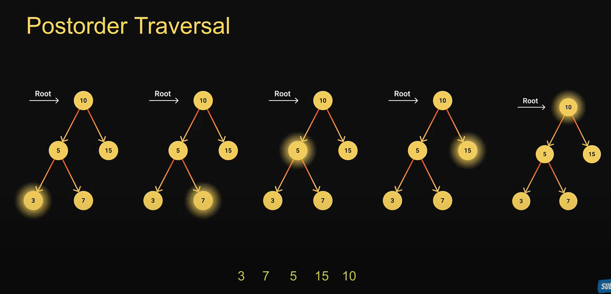
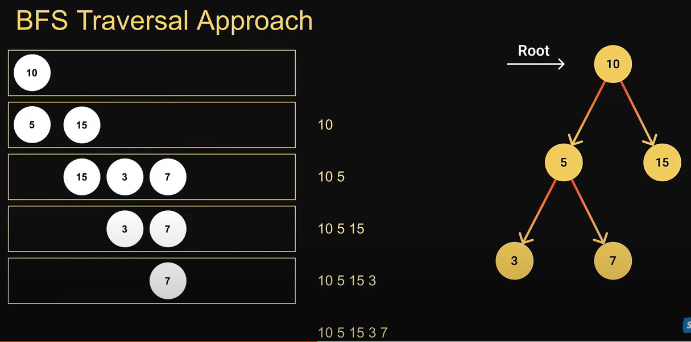
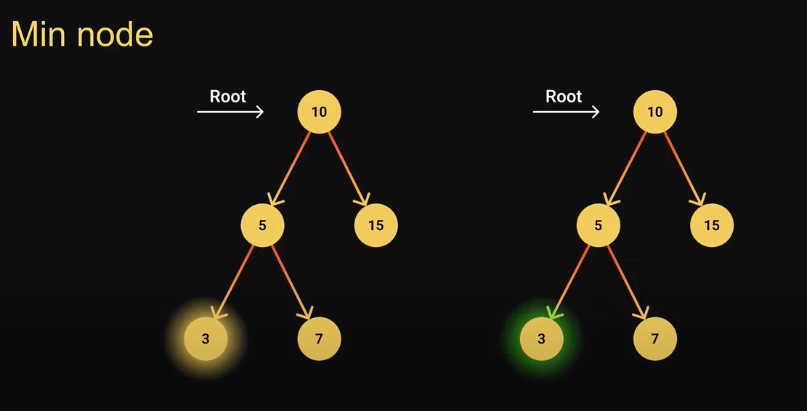
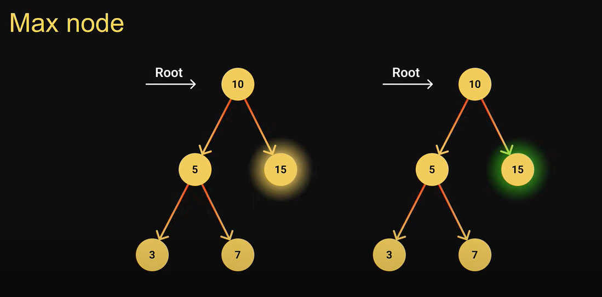
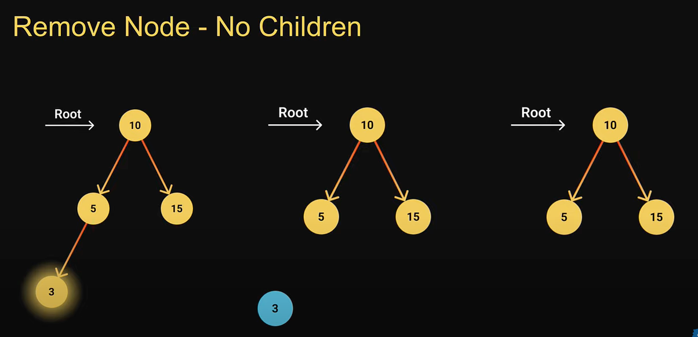
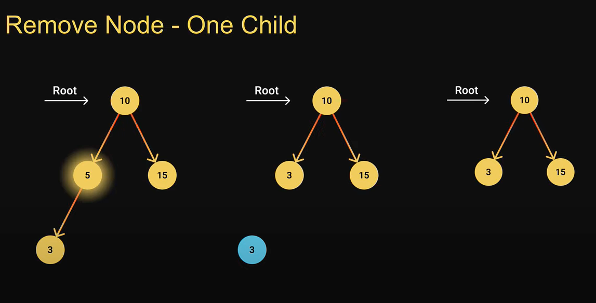
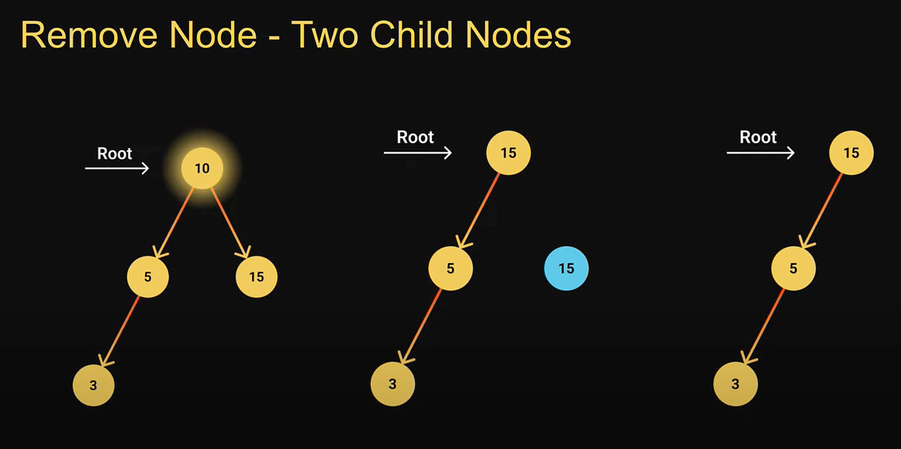

# Binary Search Tree

```text
1. Value of each LEFT node must be smaller than PARENT node
2. Value of each RIGHT node must be greater than PARENT node
3. Each node having AT MOST 2 children

left node < PARENT < right node

Searching, Sorting, Abstract Data Types (ADT) such as look up tables and
priority queues
```

---

## Depth First Search

- starts at root node
- explores as far as possible on each branch before backtracking
- ex: start root, visit all left nodes, backtrack, visit all right nodes
- 3 types:
    1. PreOrder:  root node, visit all left, visit right while backtracking
    2. InOrder:   visit all left, parent node, visit right while backtracking
    3. PostOrder: visit all left, visit right, parent node

### PreOrder


### InOrder


### PostOrder



---

## Breadth First Search (BFS)




- explore all nodes at present depth before moving next depth level
  Steps:
    1. Create a queue
    2. Enqueue the root node
    3. If a node exists in queue:
    - Dequeue the node from the front
    - Read node's value
    - Enqueue the node's left child if exists
    - Enqueue the node's right child if exists


---

## Find Min or Max Values

### Min Node


### Max Node


---

### Delete A Node

#### Remove Node - No Childrem


#### Remove Node - One Child


#### Remove Node - Two Child Nodes


